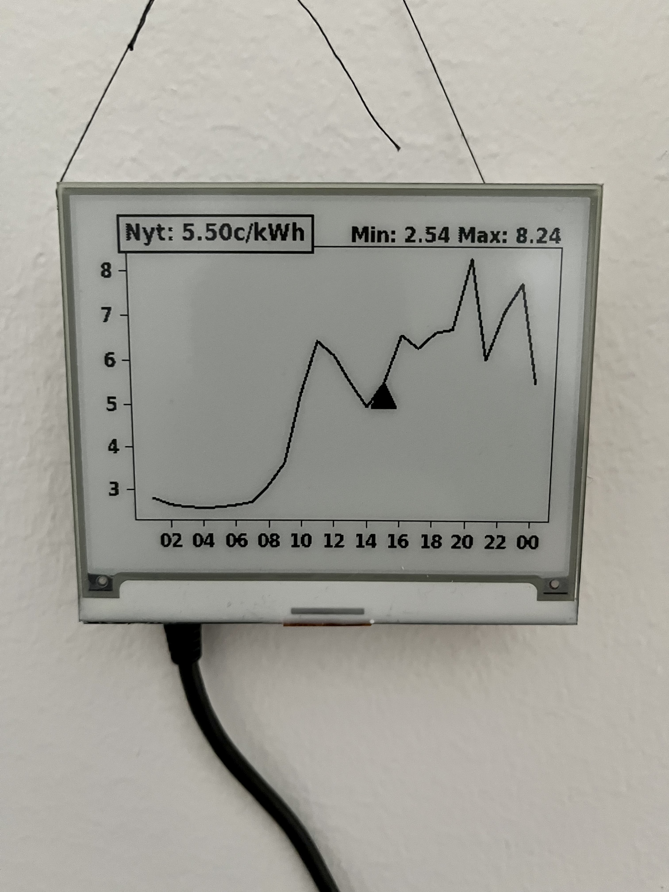

# Spot Electricity Prices Tracker Display

## Components Used

* Raspberry Pi 3
* Inky WHAT EInk display

## Getting started

* Install [raspberrypi OS](https://www.raspberrypi.com/software) on a SD card.
* Put the SD card into the device and SSH into it.
* Install 'git, python3 and python3-pip' packages.
* Clone this repo using git: 'git clone https://github.com/alamminsalo/inky-nordpool'.
* Run 'pip install -r requirements.txt' in the repo folder to install needed python packages.
* Try running with 'python update.py' to ensure everything works.
* Add a cronjob to automatically run the script every hour.
* To disable the leds, I followed [this guide](https://www.paulligocki.com/how-to-disable-lights-on-raspberry-pi/).
